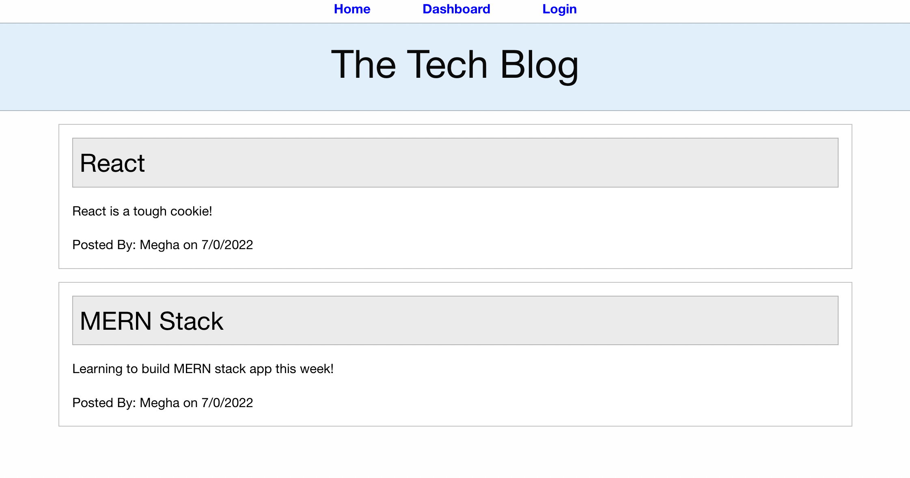

# Tech Blog
 
## Purpose
A CMS-style blog site similar to a Wordpress site, where developers can publish their blog posts and comment on other developers’ posts as well.
Users can view posts on home page.
There is option to singup and login to page.
Signing up provides the following options:
    Create new posts
    Add/Delete comments

## Built With
* NodeJs
* ExpressJS
* MySQL
* Handlebars
* Sequelize
* Foundation 

## Website

https://murmuring-ridge-84499.herokuapp.com/

## Usage

* Clone the repository.
* Run npm install.
* Make sure MySQL is installed and running.
* Run npm start.
* The server will run on localhost:3001.

## Website screenshot

## Questions

if you have any questions about the repository, open an issue/pr or contact me directly at megha.nambiar@gmail.com You can find more of my work at Github.
